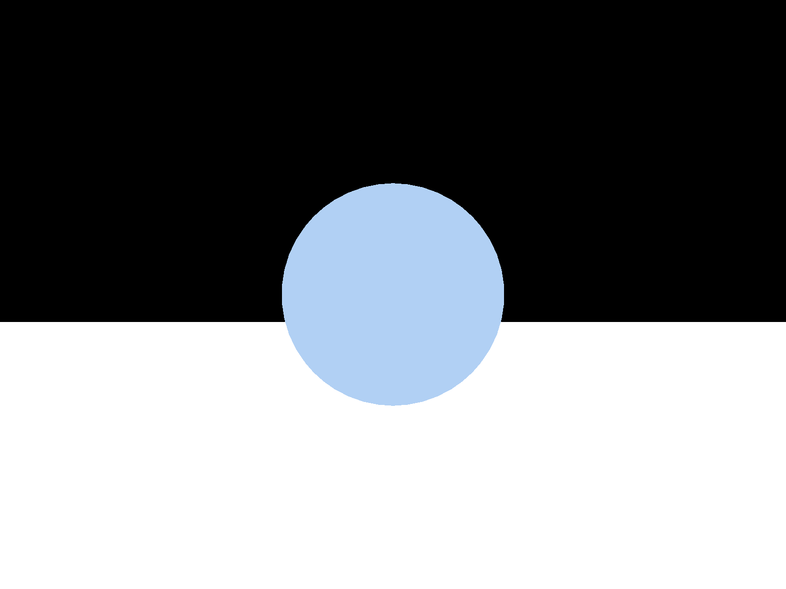
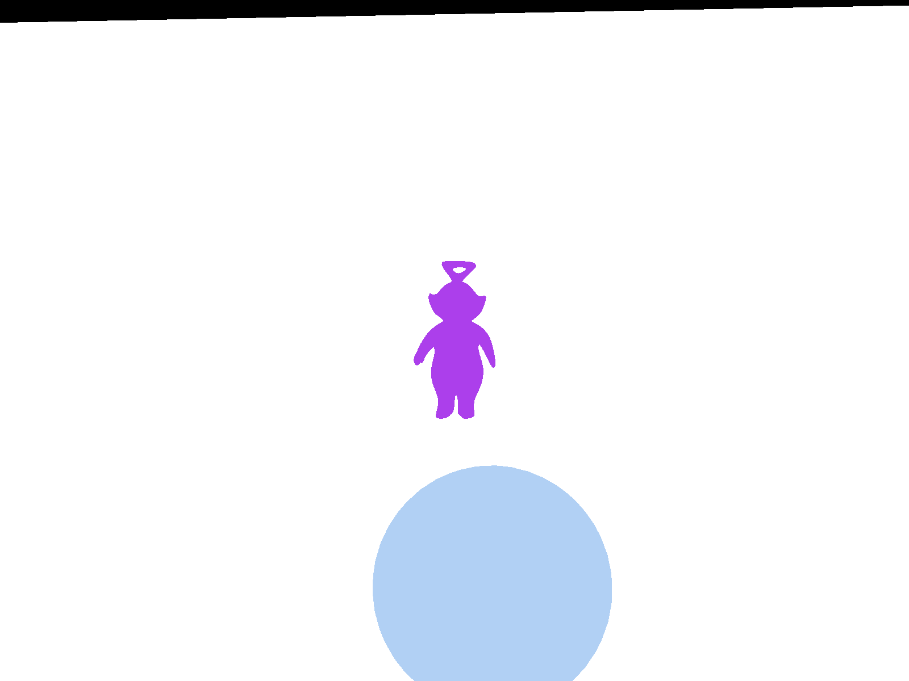
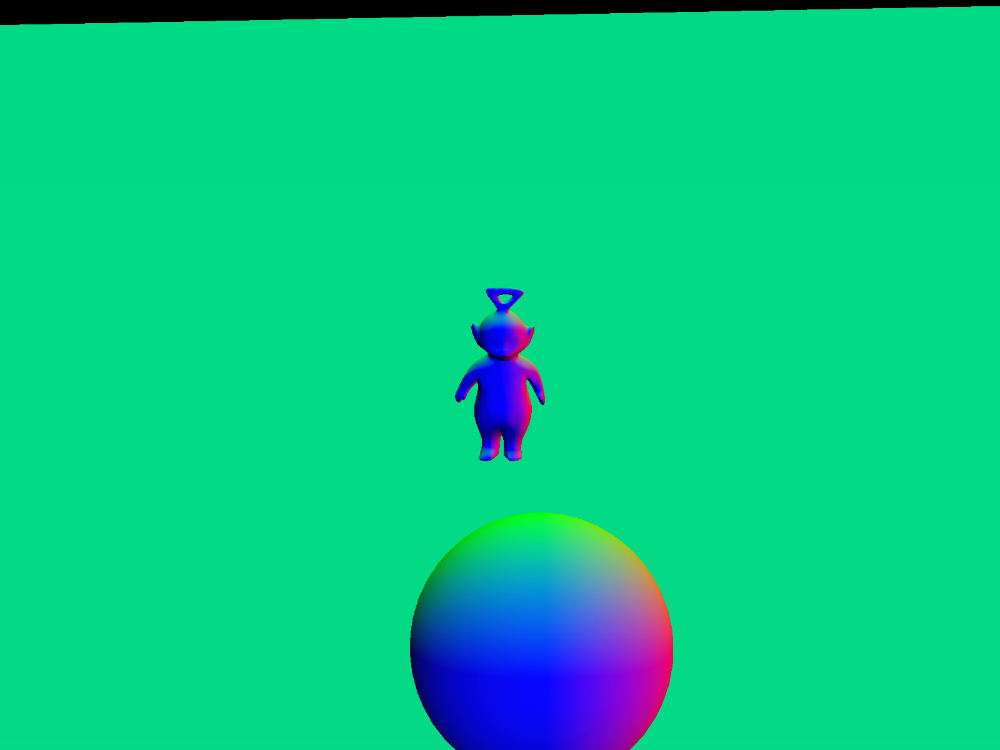
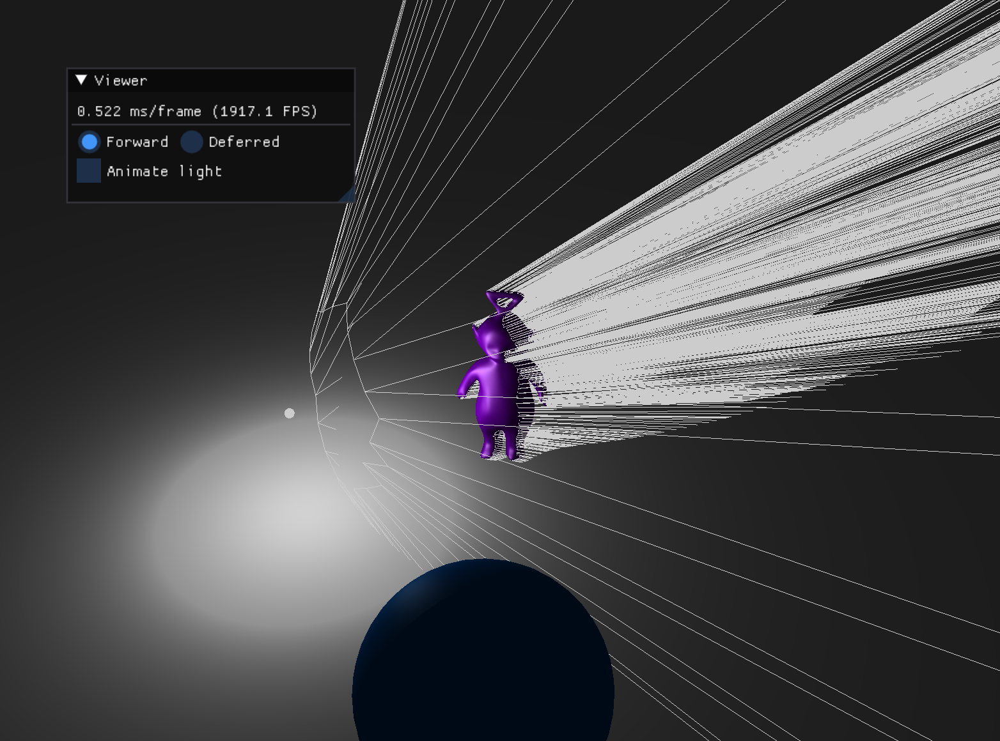
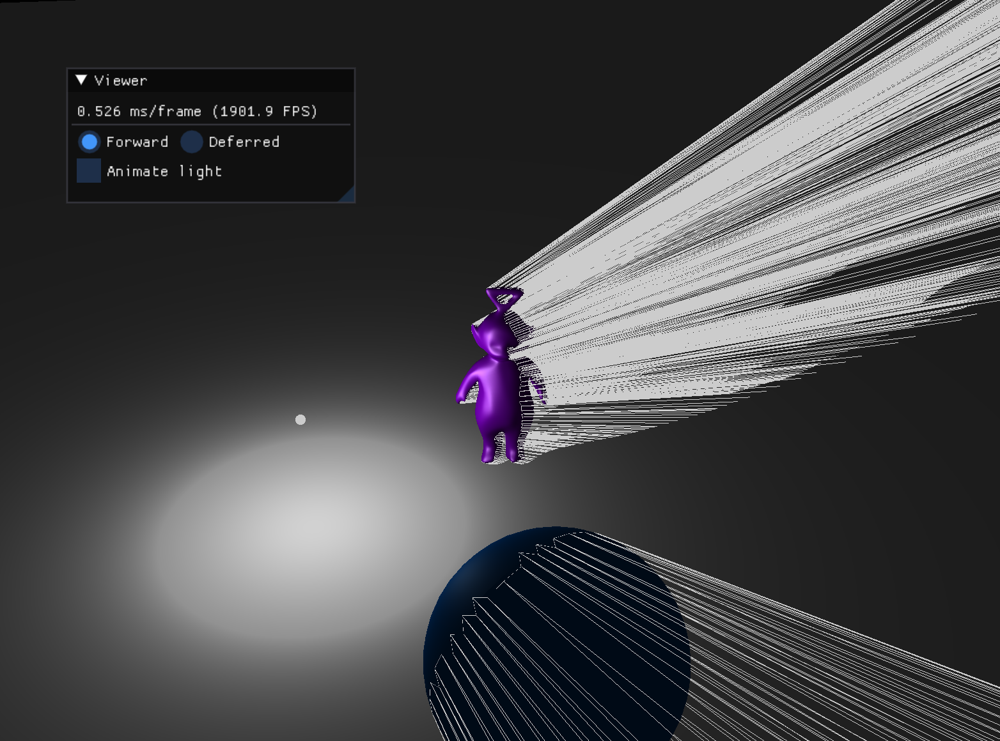
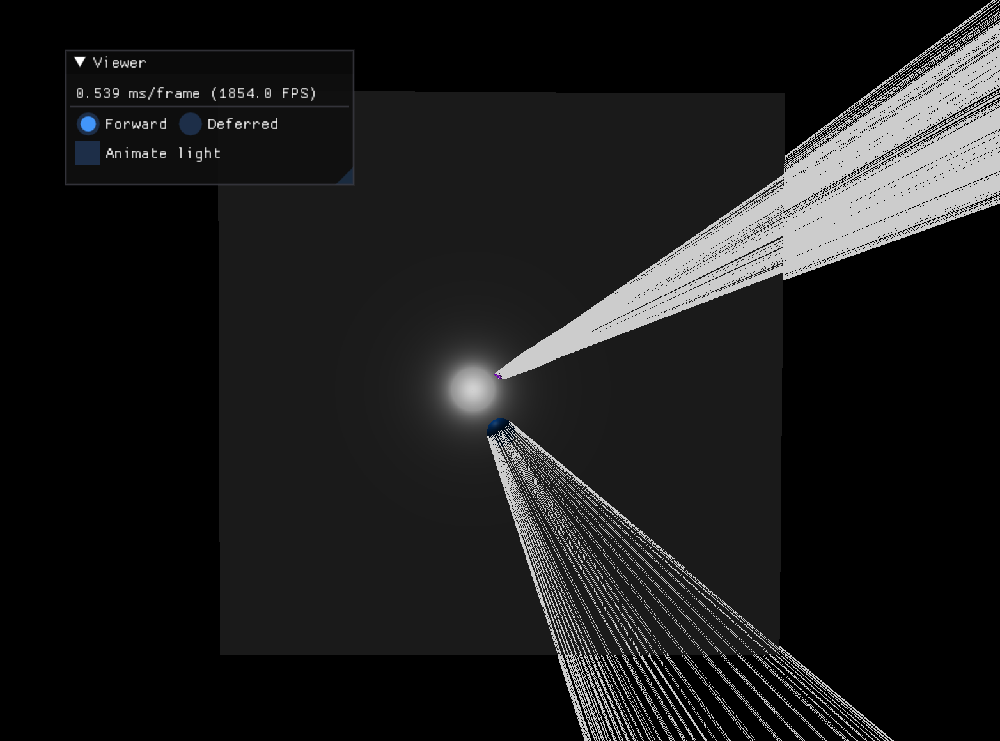

# Advanced OpenGL Rendering — Bastien Soucasse

[Dépôt GitLab](https://gitlab.emi.u-bordeaux.fr/bsoucasse/sia-gl-renderer)

## 1. Defered Shading

L'objectif est d'éviter les calculs inutiles (fragments non visibles) en procédant à un rendu en deux étapes.

### 1.1. G-Buffer

Tout d'abord, la méthode `init` de `FBO` est implémentée de manière à stocker les deux textures (couleurs et normales), ainsi que la profondeur.

Ensuite, un objet de type `Shader` a été ajouté pour charger les shaders du G-Buffer. Les shaders ont été configurés pour transmettre la couleur et la normale de chaque fragment.

Un attribut de type `FBO` a été ajouté à la classe `Viewer` et initialisé dans la méthode `init` associée. La méthode `drawDeferred` a également été complétée de manière à activer le FBO, vider ses buffers, activer les shaders du G-Buffer, leur transmettre les variables uniformes nécessaires et "dessiner" les objets de la scène (dans le G-Buffer), avant de désactiver ces shaders ainsi que le `FBO`.

Les images sauvegardées par la méthode `savePNG` témoignent de problèmes dans le code, elles ne correspondent pas à celles attendues.

Couleurs : 

Normales : 

Le problème venait du fait que lors de l'initialisation du FBO, le color attachment 0 était utilisé pour les deux textures (couleurs et normales). En adaptant de manière à automatiser l'indice utilisé, les images furent alors correctes.

Couleurs : 
Normales : 

### 1.2. Lightning

Un quad était déjà créé pour le sol de la scène dans la méthode `init` de la classe `Viewer`, il faut donc commencer par en créer un autre qui ne sera pas considéré comme un objet de la scène, en le définissant comme attribut de la classe.

Ensuite, un objet de type `Shader` a été ajouté pour charger les shaders Deferred. Les shaders ont été configurés pour récupérer les données du G-Buffer (textures de couleurs et normales comprenant la profondeur et le coefficient spéculaire) et les utiliser pour calculer la position et en déduire l'éclairage à appliquer.

La méthode `drawDeferred` a été complétée de manière à activer les shaders Deferred, leur transmettre les variables uniformes nécessaires et dessiner concrètement le quad, avant de désactiver ces shaders.

Le rendu est censé être le même entre le Forward Shading et le Deferred Shading. Cependant, le calcul de la lumière est **éclaté au sol**, comme le prouve l'image suivante.

Le problème venait du fait que la profondeur était mal récupérée. En effet, la méthode `VSPositionFromDepth` du Deferred Fragment Shader nécessite la profondeur, seulement celle utilisée était `gl_FragCoord.z` alors qu'il fallait utiliser celle transmise par le G-Buffer dans `normalTexture.w`. Le problème n'est alors plus le même.

Cette fois, l'éclairage est bien plus cohérent masi reste différent de celui du Forward Shading. Une erreur a été commise dans le Deferred Fragment Shader : le vecteur `l` a été normalisé avant sont appel dans la méthode `phong` et son utilisation pour le paramètre `lightCol` n'est alors plus valable. En rétablissant la normalisation uniquement là où nécessaire, on obtient finalement une image équivalente.

Il reste encore à appliquer cette méthode d'éclaire à toute source lumineuse. En ajoutant deux lumières ponctuelles de couleur dans la scène (`#PhilipsHue`), il est alors possible de travailler sur le rendu *GL_BLEND*, c'est-à-dire le mélange des couleurs émises par les différentes lumières.

Pour cela, le calcul de l'éclairage et le dessin du quad ont été réalisés au sein d'une boucle itérant sur chaque source lumineuse, et l'activation du mode *GL_BLEND* devrait permettre de mélanger les couleurs des pixels. Cependant, le résultat fût une image devenant progressivement complètement blanche.

En effet, il manquait un appel à `glClear` permettant de remettre à zéro l'écran et n'appliquer le blend que sur les pixels de la frame actuelle (sans ça, les couleurs s'incrémentent à l'infini et dépasse la valeur maximale, d'où l'image blanche).

Le dernier problème, persistant depuis le début de ce projet si vous avez l'œuil, est le fait qu'il n'y a pas les sources lumineuses de déssinées. Il s'agissait d'un mauvais placement du transfert des données entre les buffers. En le déplaçant juste avant l'appel à `drawLights`, on peut visualiser les sources lumineuses également.

## 2. Shadow Volume

### 2.1. Building

Pour construire le volume d'ombre, la méthode `computeShadowVolume` a été implementée, utilisant deux nouvelles méthodes utilitaires : `getShadowVolumeQuadPoints` qui retourne les coordonnées des quatre sommets du quad à créer à partir d'une arête du maillage, et `is_enlightened` qui détermine si une face est éclairée ou non.

La première initialisation met en évidence une erreur de segmentation due au fait que la propriété de sommets `v:position` n'avait pas été initialisée.

Une fois l'initalisation fonctionnelle, il est alors possible de dessiner le volume d'ombre construit.

En appliquant la transformation de la sphère au volume d'ombre, ainsi qu'en calculant la position de la lumière en espace objet, il est alors possible de résoudre le décalage du volume d'ombre appliqué aux objets transformés dans la scène. 

