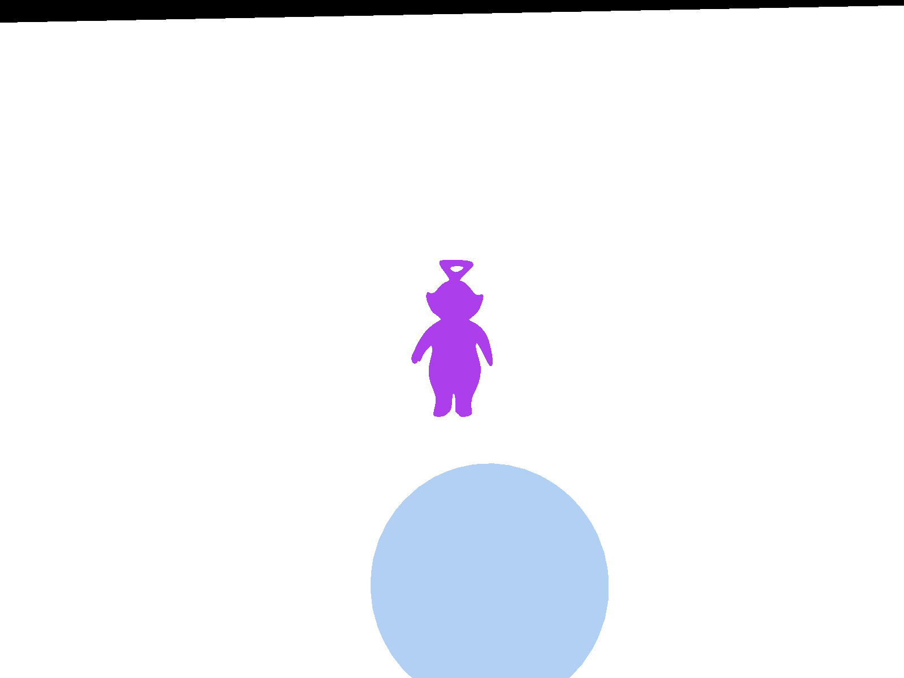
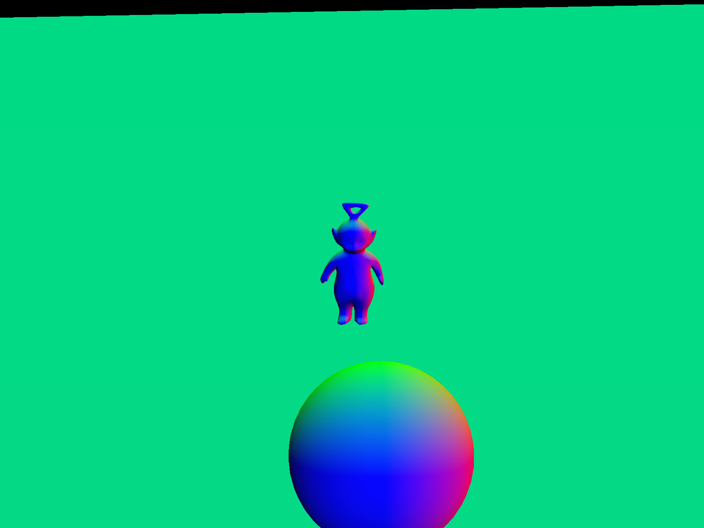

# Advanced OpenGL Rendering

## 1. Defered Shading

L'objectif est d'éviter les calculs inutiles (fragments non visibles) en procédant à un rendu en deux étapes.

### 1.1. G-Buffer

Tout d'abord, l'objet FBO est initialisé de manière à stocker les deux textures (couleurs et normales), ainsi que la profondeur.

Ensuite, un objet de type `Shader` a été ajouté pour charger les shaders du G-Buffer. Les shaders ont été configurés pour transmettre la couleur et la normale de chaque fragment.

Un objet de type `FBO` a été ajouté dans `Viewer` et initialisé dans la méthode `init`. La méthode `drawDeferred` a été complétée de manière à activer le FBO, vider ses buffers, transmettre aux shaders les variables uniformes nécessaire et désactiver le FBO.

Les images sauvegardées par la méthode `savePNG` témoignent de problèmes dans le code, elles ne correspondent pas à celles attendues.

Couleurs : 

Normales : 

Le problème venait du fait que lors de l'initialisation du FBO, le `color attachment` 0 était utilisé pour les deux textures (couleurs et normales). En remplaçant par la ligne suivante, les images furent alors correctes.

```c++
glFramebufferTexture2D(GL_FRAMEBUFFER, i == 0 ? GL_COLOR_ATTACHMENT0 : GL_COLOR_ATTACHMENT1, GL_TEXTURE_2D, textures[i], 0);
```

Couleurs : 
Normales : 
